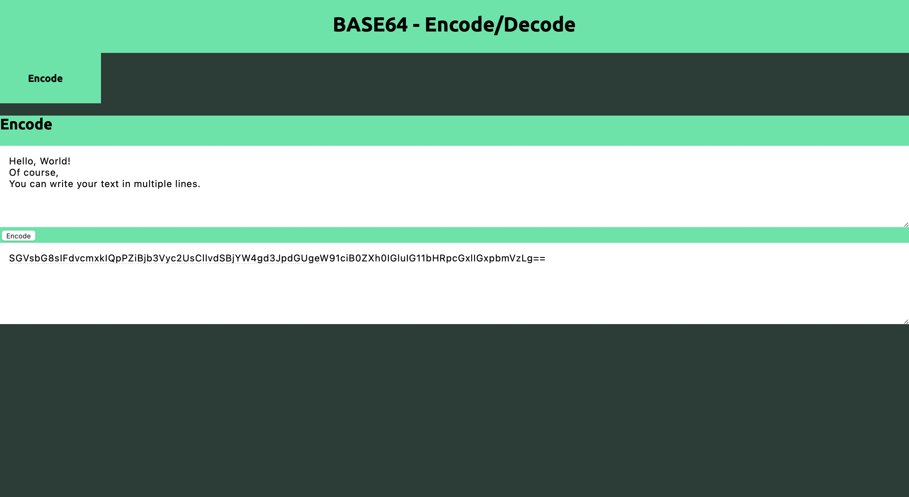

# A simple web application to encode/decode in base64
Made with React and TypeScript on frontend, Go and it's default libraries on backend.
This project is kind of esoteric, I got an idea to make it once I have noticed encoding/base64 in Go default library.



# Installattion
0. Have Go 1.19 and Node.js v16 installed
1. Clone the repository
2.
```bash
cd web
yarn
```

# Running
1. Start an API

```bash
cd api
go run main.go
```
OR 
```bash
go build -o main
./main
```

2. Start frontend
```bash
cd web
yarn start
```

# To-Do
* make better css
